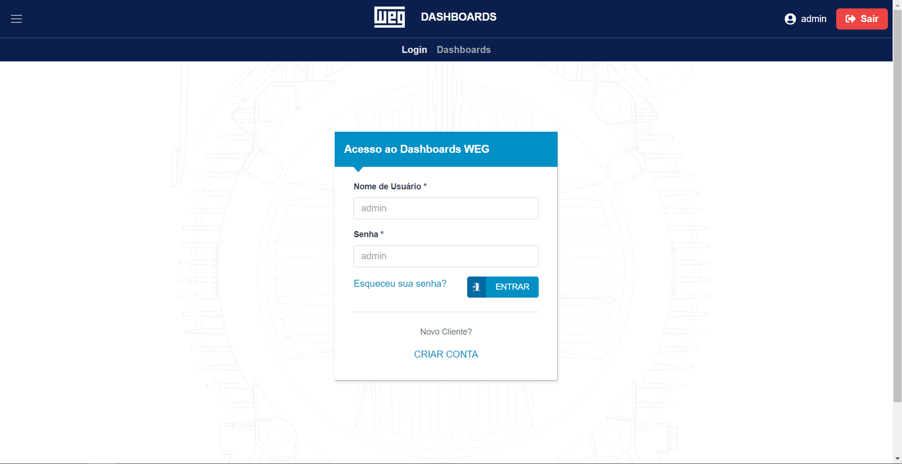

# <a href="https://weg-dashboards.vercel.app/">WEG Dashboards</a>

## :camera: Overview

<div align="center" >
  
</div>

<div align="center" >
  
</div>

<div align="center" >
  
</div>
<br>
<br>

# 📚 Description

This repository was created as part of an application for a full-stack web development position at WEG. The position required expertise in statistics and data science, as well as experience building dashboard monitoring websites. To showcase my skills and experience, I created two projects, and this is one of them.
<br>
<br>
The first project, Megasena-Generator, is a full-stack application that incorporates advanced data science analyses, including statistics and machine learning. It features a backend API built with Python/Django and a modern frontend with React, using the latest tools as of 2023.
<br>
<br>
However, while Megasena-Generator includes graphs using Charts.js, it lacks some of the dashboard functionality that WEG was specifically looking for. To address this, I created a separate project, WEG Dashboards, that focuses on building customizable and interactive dashboards using two additional libraries: Plotly.js and Victory. The project also includes a simple login form with JWT authentication, built with Python/Django. 
<br>
<br>
It's worth noting that building fully responsive dashboards can be challenging, and while I've made every effort to ensure a positive user experience across devices, I recommend using a desktop for the best experience.
<br>
<br>
You can check the live website here:<br>
https://weg-dashboards.vercel.app/
<br>
<br>
username (Nome de Usuário): admin <br>
password (Senha): admin
<br>
<br>
<div id="technologies">
  <h2>:rocket: Technologies</h2>
</div>

### Backend

✔️ Python | ✔️ Django | ✔️ JWT

### Frontend

✔️ TypeScript | ✔️ ReactJS | ✔️ NextJS | ✔️ TailwindCSS | ✔️ Plotly | ✔️ Victory

<div id="running_backend">
  <h2>⚙ Running [Backend]</h2>
</div>

```bash
# Clone this repository
$ git clone https://github.com/leonardoacr/weg-dashboards.git

# Access the backend folder

$ cd backend

# Update pip

$ update pip
$ python.exe -m pip install --upgrade pip

# Activate the virtual environment

$ pip install virtualenv
$ virtualenv venv
$ venv\scripts\activate

# Install dependencies

$ pip install -r requirements.txt

# Go to "myproject" directory

$ cd myproject

# Run the server on http://127.0.0.1:8000

$ python manage.py runserver
```

<div id="running_frontend">
  <h2>⚙ Running [Frontend]</h2>
</div>

```bash
# Access the frontend folder

$ cd frontend

# Install packages

$ npm install

# Run the server on http://localhost:3000

$ npm run dev
```